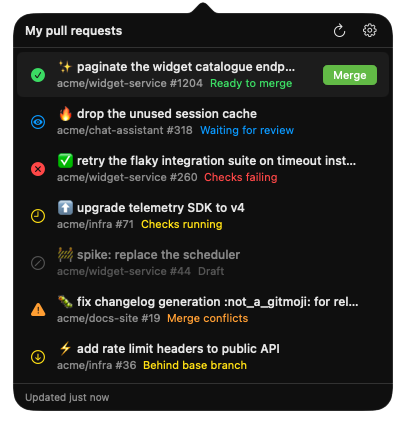

# PR Master Tray

A macOS menu bar app that lists your open pull requests and says which ones
GitHub would merge right now.



## Features

- Lives in the menu bar, with a count of how many pull requests are ready to
  merge.
- One row per open pull request of yours, each showing why it can or cannot be
  merged: ready, waiting for review, checks running, checks failing, merge
  conflicts, behind base branch, or draft.
- A notification the moment a pull request becomes mergeable, with **Open PR**
  and **Merge** actions.
- Squash and merge straight from the list or the notification, after a
  confirmation.
- Pull requests that fall behind their base branch are brought up to date
  automatically. Can be turned off from the gear menu.
- **Settings…** in the gear menu chooses what the list is made of: which
  organizations to include, and whether pull requests from private repositories
  show at all. Hidden ones are left out of the count, never notify, and are never
  brought up to date automatically.
- Refreshes every minute, on opening the popover, and on waking the machine. A
  failed refresh keeps the last good list and tells you it is stale.
- Checks for new versions of the app and installs them for you.
- Signs in through the `gh` CLI, so it stores no credentials of its own.

## Install

```sh
curl -fsSL https://github.com/juancarlosllhL/PRMasterTray/releases/latest/download/PRMaster.app.zip -o /tmp/prmaster.zip \
  && ditto -x -k /tmp/prmaster.zip /tmp/prmaster \
  && rm -rf /Applications/PRMaster.app \
  && ditto /tmp/prmaster/PRMaster.app /Applications/PRMaster.app \
  && xattr -cr /Applications/PRMaster.app \
  && rm -rf /tmp/prmaster /tmp/prmaster.zip \
  && open /Applications/PRMaster.app
```

The app is not notarized, so `xattr -cr` is the step that lets Gatekeeper launch
it. Apple Silicon only.

## Requirements

- macOS 14+
- [`gh`](https://cli.github.com), installed and signed in:

```sh
brew install gh
gh auth login
```

- Notification permission, granted under **System Settings → Notifications**.
  Without it the list and the count still work, but nothing tells you when a
  pull request becomes mergeable.
