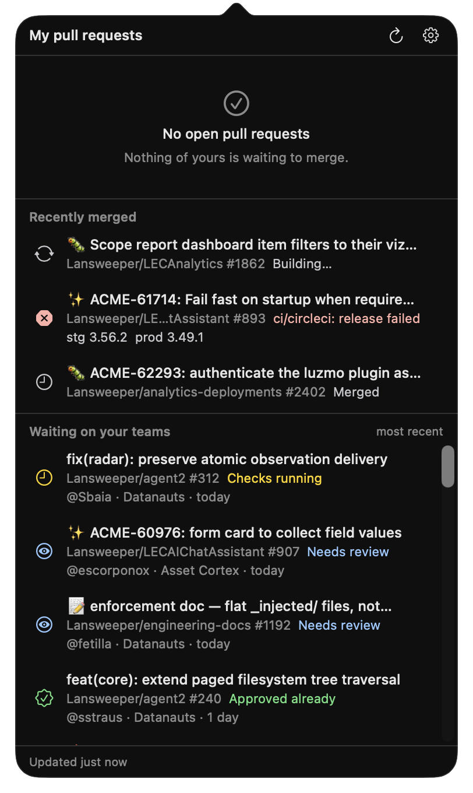
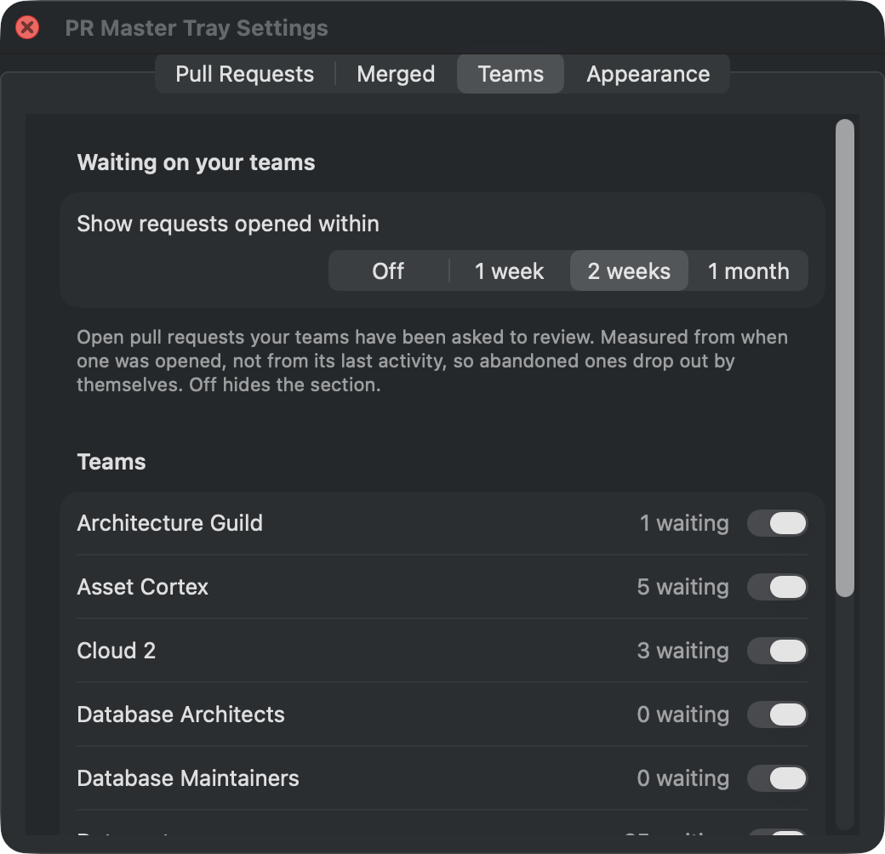

# PR Master Tray

A macOS menu bar app that lists your open pull requests and says which ones
GitHub would merge right now.


## Features

- Lives in the menu bar, with a count of how many pull requests are ready to
  merge.
- One row per open pull request of yours, each showing why it can or cannot be
  merged: ready, waiting for review, checks running, checks failing, merge
  conflicts, behind base branch, or draft.
- A notification the moment a pull request becomes mergeable, with **Open PR**
  and **Merge** actions.
- Squash and merge straight from the list or the notification, after a
  confirmation.
- Pull requests you opened a long time ago and forgot are marked with their age,
  and can be closed from the list after a confirmation. Measured from when the
  pull request was opened rather than from its last activity, so keeping a branch
  up to date does not reset it. The threshold is a setting: off, two weeks, one
  month, three months or six months.
- Pull requests that fall behind their base branch are brought up to date
  automatically. Can be turned off from the gear menu.
- **Recently merged** lists what you merged recently and what became of
  it: its CircleCI pipeline still building, the name of the check that failed,
  or the version it went out in. Clicking a row opens the pipeline while there
  is one worth watching, and the release once there is one. How far back it
  reaches is a setting: off, one day, three days or one week. The version is the
  release whose tag contains your merge commit — that it was cut. Repositories
  that cut no releases show how their checks did and nothing more.
- **stg** and **prod** chips say which version each environment was promoted to,
  read from the `stableVersion` Kargo commits into the deployments repository.
  A chip is green only when your merge commit is provably inside that version,
  by comparing commits rather than version numbers: an environment can sit on a
  higher version cut from another branch that does not carry your change at all.
  Promoted is not deployed — Argo CD syncs separately, so a failed sync or a
  crash-looping pod still reads as promoted. No chip means nothing could be
  established, which is never the same as nothing being there.
- **Waiting on your teams** lists open pull requests that a GitHub team you
  belong to has been asked to review — not yours, and not ones you have already
  reviewed. Each row says who opened it, which of your teams was asked, how long
  it has been open, and whether its checks passed, so a red or already-rejected
  pull request is visible before you click. Clicking opens it; **Approve** posts
  a real, public review under your own name, after a confirmation naming the
  author.

  One you approved comes back if the author pushes and GitHub throws your
  approval away, marked **Approval dismissed** so it is not mistaken for a pull
  request you have never seen. GitHub drops the team's request the moment you
  review and does not restore it, so this is found by asking a second question
  rather than by the same search, and it is attributed to whichever of your
  teams was originally asked.

  The approval carries a one-line remark, chosen from the pull request itself —
  its size, whether it deleted more than it added, what its title claims, how
  its checks did, how long it sat there. The confirmation quotes the line before
  anything is posted, and the switch in Settings turns the whole thing off.

  How far back it reaches is a setting, and it is the setting that makes the
  section usable rather than a preference on top of one: measured against nine
  real teams, there were 1846 pull requests pending review with no limit at all
  and 76 with two weeks. The rest were release-bot and dependency-bump branches
  abandoned months earlier. Measured from when a pull request was opened rather
  than from its last activity, so a bot that rebases its own branch nightly
  cannot keep itself at the top of the list. Off hides the section entirely.



- **Teams** in Settings lists every team you belong to, including ones you
  maintain, with how many pull requests are pending each — so you can see what
  switching one on would cost before you do it. New teams arrive switched on:
  being added to one is somebody else's decision, so it has to show up by itself
  rather than stay invisible until you go looking.



- **Settings…** in the gear menu chooses what the list is made of: which
  organizations to include, and whether pull requests from private repositories
  show at all. Hidden ones are left out of the count, never notify, and are never
  brought up to date automatically. Both also apply to the teams section above.
- The popover has two tabs. **Pull requests** is everything above, in the order
  it has always been in. **Jira** is the issues assigned to you that are not
  done. Command-1 and Command-2 switch between them.
- **Jira** lists each assigned issue with its own status, and expands to the
  pull requests carrying its key in their title. One issue routinely spans
  several repositories, which is what the nesting is for.

  An issue with nothing against it says **No PRs open**. The search is scoped to
  your own pull requests, so a colleague's work on your issue does not appear
  here. An issue whose lookup *failed* says so instead, because "nothing found"
  and "couldn't check" look identical otherwise, and the first is a lie when the
  second is true.

  Statuses are grouped by Jira's status category rather than its name. A site
  can rename or localise a status freely — this one has **Awaiting Customer**,
  **On Hold**, **New** and **Testing** — and only the category underneath is
  stable.

  Finding the pull requests costs one request no matter how many issues you
  have, and the key match is exact: `ACME-6023` never pulls in `ACME-60236`.
- **Jira** in Settings is where you sign in: your site, your email, and an API
  token from [id.atlassian.com](https://id.atlassian.com) under Security.
  Nothing is stored until it has been tested, so a typo is refused where you
  typed it rather than an hour later as a failed refresh. On success it names
  who it signed in as. A rejection blames the email and token together, because
  Jira answers a bad token, a wrong email and outright nonsense identically, and
  naming one would be a guess. **Sign Out** removes the token from the Keychain.
- Refreshes every minute, on opening the popover, and on waking the machine. A
  failed refresh keeps the last good list and tells you it is stale.
- Checks for new versions of the app and installs them for you.
- **Open at login** in the gear menu brings it back by itself after a restart. It
  starts straight into the menu bar, with no window to dismiss. The first time,
  macOS may ask you to approve it under **System Settings → General → Login
  Items**; the menu says so, and offers a way there.
- GitHub access comes from the `gh` CLI, so there is no GitHub credential of its
  own to leak. Jira is different, and worth being plain about: it needs an API
  token you create yourself, and that token is a credential the app does hold.
  It goes in your login Keychain, is sent only to your own Jira site, and never
  reaches preferences, a log or a fixture.

## Install

```sh
curl -fsSL https://github.com/juancarlosllhL/PRMasterTray/releases/latest/download/PRMaster.app.zip -o /tmp/prmaster.zip \
  && ditto -x -k /tmp/prmaster.zip /tmp/prmaster \
  && rm -rf /Applications/PRMaster.app \
  && ditto /tmp/prmaster/PRMaster.app /Applications/PRMaster.app \
  && xattr -cr /Applications/PRMaster.app \
  && rm -rf /tmp/prmaster /tmp/prmaster.zip \
  && open /Applications/PRMaster.app
```

The app is not notarized, so `xattr -cr` is the step that lets Gatekeeper launch
it. Apple Silicon only.

## Requirements

- macOS 14+
- [`gh`](https://cli.github.com), installed and signed in:

```sh
brew install gh
gh auth login
```

- The `read:org` scope, which is what lets the app see which teams you belong to.
  Without it GitHub answers the team lookup with an error rather than an empty
  list, so the popover says it couldn't check your teams instead of quietly
  claiming you belong to none. Add it with:

```sh
gh auth refresh -s read:org
```

- Notification permission, granted under **System Settings → Notifications**.
  Without it the list and the count still work, but nothing tells you when a
  pull request becomes mergeable.
